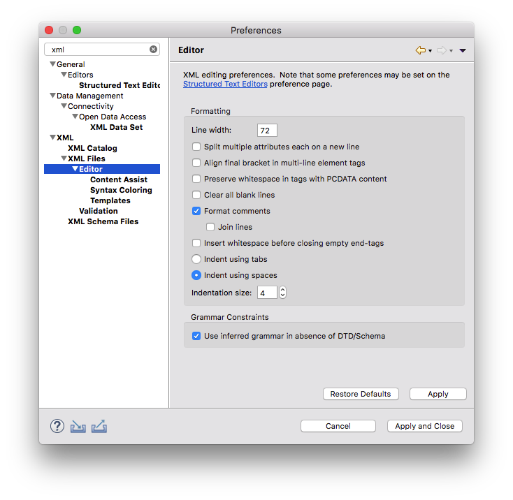

# Orchsym 开发指南

## IDE要求

不做任何要求，开发环境可任意，因为所有源代码工程均为Maven工程，所以任意IDE均可，诸如Eclipse、IDEA、VS Code。 选择您擅长的熟悉的开发工具即可。

## 代码格式规范
仅对代码格式做了规范，以避免由于格式问题导致的Code Review难度。

### Java文件

目前仅提供了，Eclipse环境的[代码格式化文件](./eclipse-java-editor-formatter.xml)，打开Preference，定位到 `Java/Code Style/Formatter` 导入格式配置文件，选择 **Orchsym**。

### XML 文件

在Eclipse环境，可采用类似的配置：

## 文件头说明

对于新提交的文件，都应附加上文件头，相关格式说明，参见 [文件头说明](./LICENSE_HEADER.md)

## License

Except as otherwise noted this software is licensed under the
[Orchsym License, Version 1.0]

Licensed under the Orchsym License, Version 1.0 (the "License");
you may not use this file except in compliance with the License.
You may obtain a copy of the License at
    
https://github.com/orchsym/runtime/blob/master/orchsym/LICENSE
    
Unless required by applicable law or agreed to in writing, software
distributed under the License is distributed on an "AS IS" BASIS,
WITHOUT WARRANTIES OR CONDITIONS OF ANY KIND, either express or implied.
See the License for the specific language governing permissions and
limitations under the License.

